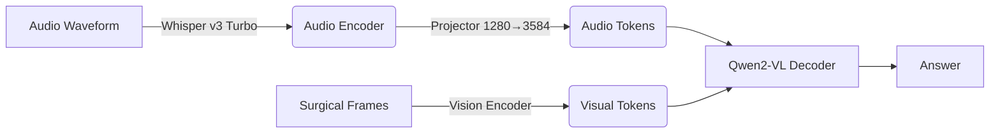

# 🩺 SurgViVQA-Audio: Audio-Adapted Qwen2-VL for Surgical Video QA
> **Goal:** Engineering a multimodal agent to “hear” live OR audio (no ASR) and “see” surgical video for real-time QA.
> ⚠️ **Research prototype only — not for clinical use.**

**Quick Links:** [🤗 Model Weights](https://huggingface.co/kulsoom-abdullah/surgvivqa-qwen7b-audio) | [📊 Data Distribution](docs/data_distribution.md) | [🎬 Streamlit Demo](#streamlit-demo) | [📈 Results](#results)

> **Data note:** This repo does **not** redistribute SurgViVQA frames or the generated TTS audio. It includes scripts to reproduce preprocessing from the public benchmark.

---

## 🛠️ The Engineering Journey

*From Proof-of-Concept to Generalization*

### 1. Feasibility (Multimodal Adaptation Test)
* **Challenge:** My [previous work](https://github.com/kulsoom-abdullah/Qwen2-VL-Audio-Adapter) adapted audio as an input option to Qwen2. This project tests adding audio to a vision-language model so it can handle audio + vision → text.
* **Method:** Trained on a small set (10 samples) until Loss converged quickly to 0.
* **Result:** Confirmed the end-to-end gradient flow (Audio + Vision → Text) was functional before scaling the training.

### 2. Bias Mitigation (Stratified Scaling)
* **Challenge:** Medical data is often imbalanced. While this set, SurgViVQA, was not severely skewed globally (61% Yes/No), critical categories like `tool_identification` represent only **3.7%** of the data. Random splitting risked leaving these out of the validation set.
* **Solution:** Implemented **Question-Type Stratification** ([`scripts/create_multivideo_split.py`](scripts/create_multivideo_split.py)) to ensure every category (e.g., Tools, Motion, Lesion) was represented in the 15% Eval split.
* **Result:** Achieved **84% accuracy** on safety-critical classes like `occlusion_check`.

### 3. Generalization (Held-Out Video)
* **Challenge:** Prevent the model from overfitting to procedure-specific visual patterns.
* **Method:** Evaluated on a completely unseen video (`002-004`) to test generalization to an unseen video.
* **Result:** **63.4% Accuracy** on held-out test set (+17.4 points over [zero-shot baseline](baselines/baseline2_audio_image.py)).

### 4. Deployment (Streamlit Demo)
* **Output:** Built an interactive app ([`src/app.py`](src/app.py)) with "Flipbook" animation to visualize temporal motion for clinicians.
* **Features:** Question type filtering, 8-frame grid view, animated playback (2 FPS), audio recording with live inference.

---

## 📊 Data Distribution

I used a portion of the [**SurgViVQA**](https://github.com/madratak/SurgViVQA/) dataset [1], generating audio from the text questions using [edge-tts](https://github.com/rany2/edge-tts) to simulate a spoken-query environment.

### Dataset Splits

| Split | Samples | Video IDs (Procedures) | Purpose |
|-------|---------|------------------------|---------|
| **Train** | 2,302 | 002-001, 002-002, 002-003 | Model Training |
| **Eval** | 398 | 002-001, 002-002, 002-003 | In-Training Validation |
| **Test** | 1,000 | 002-004 (held-out) | Generalization Testing |
| **Total** | **3,700** | 4 colonoscopy procedures | 20 question types |

**Terminology:** Each **sample** = 1 question + 8 consecutive frames + 1 answer. **Video IDs** refer to different colonoscopy procedures.

### High-Level Statistics

- **Question Types:** 20 distinct categories across 4 reasoning domains
- **Answer Format Distribution:**
  - **Yes/No questions:** 13 types (65% of question types)
    - Examples: occlusion_check, scope_motion, tool_catheter_check
  - **Limited-Choice questions:** 7 types (35% of question types)
    - 2-5 options per question
    - Examples: lesion_motion_direction (5 directions), lesion_site (4 locations), scope_motion_type (2 types)
- **Answer Distribution (training set):**
  - Yes: 25.7% | No: 35.4% | Limited-choice: 38.8%
- **Held-Out Test Set Characteristics:**
  - Mixed balance: Motion and occlusion questions are balanced (50/50), while tool/dye presence questions in this specific video slice are single-class (100% 'No'), reflecting the specific procedure's nature.
  - Limited-choice questions evenly distributed (e.g., lesion_motion_direction: 20% per direction)
  - Some categories have zero variety (lesion_size_range: 100% <5mm, tool_identification: 100% forceps)

📄 **See detailed breakdown:** [docs/data_distribution.md](docs/data_distribution.md)

---
<a id="results"></a>
## 📈 Results

### Performance Summary

**Best Checkpoint:** `checkpoint-1000` (epoch 3.48, selected by early stopping)

| Metric | Eval Set | Test Set (Held-Out) |
|--------|----------|---------------------|
| **Overall Accuracy** | 67.84% | **63.4%** (634/1000) |
| **Zero-Shot Baselines** | - | 44-46% (text or audio) |
| **Improvement** | - | **+17.4 points** |

**Baseline Comparison:**
I compared an end-to-end audio-adapted model (raw audio → Whisper encoder embeddings; no decoding → projector → Qwen2-VL) against a traditional two-stage pipeline (Whisper ASR text → Qwen2-VL).
* **Accuracy:** Fine-tuning the audio-adapted model improved accuracy from ~46% (zero-shot) to **63.4%**, matching the performance of text-based approaches while using raw audio.
* **Speed:** 2.5× faster end-to-end by skipping intermediate transcription (**0.9s vs 2.3s**, batch=1), equivalent to **1.07 vs 0.43 samples/sec** under the same setup.
* 📄 **Baseline scripts:** [`baseline1_text_image.py`](baselines/baseline1_text_image.py) | [`baseline2_audio_image.py`](baselines/baseline2_audio_image.py) | [`baseline3_asr_pipeline.py`](baselines/baseline3_asr_pipeline.py)

---

### Performance by Question Type (Held-Out Test Set - Procedure 002-004)

**Perfect Scores (100%):**
| Question Type | Accuracy | Reason |
|---------------|----------|--------|
| blue_dye_presence | 100.0% (50/50) | Binary question, clear visual signal |
| endoscope_visibility | 100.0% (50/50) | Unambiguous visibility assessment |
| lesion_size_range | 100.0% (50/50) | All test samples <5mm (no variety) |
| lighting_mode | 100.0% (50/50) | All test samples NBI mode (no variety) |
| tool_catheter_check | 100.0% (50/50) | Binary tool presence |

**Strong Performance (>75%):**
| Question Type | Accuracy | Notes |
|---------------|----------|-------|
| scope_outside | 98.0% (49/50) | Clear visual boundary detection |
| occlusion_check | 84.0% (42/50) | Safety-critical, well-represented in training |

**Moderate Performance (50-75%):**
| Question Type | Accuracy | Challenge |
|---------------|----------|-----------|
| tool_identification | 66.0% (33/50) | All test samples: forceps only (limited variety) |
| nbi_status | 56.0% (28/50) | Binary lighting mode detection |
| scope_forward_motion | 54.0% (27/50) | Temporal reasoning across 8 frames |
| mucosa_visibility | 52.0% (26/50) | Subjective visibility assessment |
| scope_backward_motion | 50.0% (25/50) | Motion direction (temporal) |
| scope_motion | 50.0% (25/50) | Binary motion detection |

**Challenging Questions (<50%):**
| Question Type | Accuracy | Root Cause |
|---------------|----------|------------|
| flush_action | 48.0% (24/50) | Subtle fluid motion detection |
| scope_motion_type | 46.0% (23/50) | 2-way classification (advancing/withdrawing) |
| lesion_histology_extended | 46.0% (23/50) | All test: hyperplastic (no variety) |
| fluid_occlusion_level | 44.0% (22/50) | 2-way classification (absent/complete) |
| lesion_site | 34.0% (17/50) | 2-way in test (sigma/rectum), limited training |

**Hardest Questions (<25%):**
| Question Type | Accuracy | Analysis |
|---------------|----------|----------|
| **lesion_motion_direction** | **20.0% (10/50)** | 5-way classification, temporal modeling limitation |
| **lesion_screen_position** | **20.0% (10/50)** | 4-way spatial reasoning (quadrant detection) |

---

### Key Insights

✅ **What the model does well:**
- Binary Yes/No questions with clear visual signals (98-100%)
- Safety-critical assessments like occlusion detection (84%)
- Some 100% scores are artifacts of single-class test slices.

⚠️ **Where the model struggles:**
- **Multi-way classification** (5-way motion: 20%, 4-way position: 20%)
- **Temporal reasoning** across 8 frames (motion questions: 20-54%)
- **Fine-grained spatial reasoning** (lesion position quadrants: 20%)

**Root causes:**
1. **Frame independence:** Model processes 8 frames independently, lacks video-native temporal modeling
2. **Resolution constraint:** 384px may be too low for precise spatial localization
3. **Limited test variety:** Some perfect scores (100%) are due to single-class test sets (all <5mm, all NBI, all forceps)

📊 **Full evaluation:** Run evaluation script to generate detailed per-sample results

---

## 📏 Evaluation Methodology

### Metric: Keyword-Based Exact Match Accuracy

Since our questions are classification tasks (binary Yes/No or multi-class with 2-5 options), we evaluate using **answer keyword matching** rather than text generation metrics like BLEU or ROUGE.

**Implementation:**
```python
is_correct = sample['short_answer'].lower() in predicted.lower()
```

**Why this approach?**
- ✅ **Verifies factual correctness** regardless of phrasing
- ✅ **Allows natural language responses** from the LLM
- ✅ **Standard for factoid QA** (similar to SQuAD, TriviaQA evaluation)

**Example:**

| Ground Truth | Model Response | Evaluated As |
|--------------|----------------|--------------|
| "left" | "left" | ✅ Correct |
| "left" | "The lesion is moving to the left" | ✅ Correct (contains keyword) |
| "left" | "right" | ❌ Wrong |
| "Yes" | "Yes, there is occlusion present" | ✅ Correct |
| "NBI" | "The lighting mode is NBI" | ✅ Correct |

This is **not** text generation quality evaluation—we only care that the model gets the right factual answer, not how eloquently it phrases it.

---

## 🏗️ Architecture

The architecture bypasses the standard ASR (Speech-to-Text) pipeline to reduce latency and error propagation, allowing the model to process raw audio embeddings directly alongside visual tokens.



### Audio Adaptation Strategy
* **Base Model:** Qwen2-VL-7B-Instruct
* **Audio Encoder:** Whisper Large v3 Turbo (Frozen)
* **Projector:** Linear Layer (1280 → 3584) trained to map audio features to the LLM's embedding space
* **Innovation:** Direct injection of 1,500 audio tokens into the multimodal sequence, allowing the model to attend to "sound" and "sight" jointly

### QLoRA Training Config

* **Hardware:** 2x NVIDIA RTX 4090 (24GB VRAM each)
* **Precision:** 4-bit Base Model + BF16 LoRA Adapters
* **LoRA Config:** Rank 64, Alpha 16, targeting all attention/MLP projections
* **Target Modules:** All linear projections (`q_proj`, `k_proj`, `v_proj`, `o_proj`, MLP layers)
* **Label Masking:** Strictly mask all vision/audio tokens (`-100`), calculating loss **only** on the assistant's text response
* **Early Stopping:** Patience=3, monitoring eval_loss (training stopped at epoch 4.53, best was 3.48)
* **Training Time:** ~6 hours for 2,300 samples on 2x RTX 4090

### 📈 Training Dynamics (Weights & Biases)

I tracked training stability using Weights & Biases to ensure proper convergence without overfitting.

| **Training Loss** | **Validation Loss (Eval)** |
| :---: | :---: |
|  |  |
| *Rapid convergence in first 200 steps* | *Optimal generalization at Step 1000 (Loss ~0.054)* |

**Analysis:**
* **Convergence:** Training loss dropped sharply, confirming the audio features were successfully mapped to the LLM embedding space.
* **Early Stopping:** Validation loss bottomed out at **Step 1000** (Epoch 3.48) and began to rise shortly after (Step 1300), triggering early stopping mechanism to prevent overfitting.
* **Total Training Time:** 350 minutes (~5.8 hours) on 2x RTX 4090.

### Memory Optimization Decisions

* **Image Resize:** Downsampled to 384x384. While this impacts small tool detection, it was necessary to fit batch size 1 on consumer VRAM
* **Attention:** Used `sdpa` (Scaled Dot Product Attention) for quantization compatibility
* **Gradient Checkpointing:** Non-reentrant mode for DDP + QLoRA compatibility

---

## 🤗 Model Weights (Hugging Face)

Weights + model card: https://huggingface.co/kulsoom-abdullah/surgvivqa-qwen7b-audio

This repo uses the HF weights via the existing training/eval scripts. If you're just evaluating:
- download/point to the checkpoint
- run `src/evaluate_checkpoint.py` as shown below


### 1. Setup Environment

```bash
# Clone repository
git clone https://github.com/kulsoom-abdullah/SurgViVQA-Audio
cd SurgViVQA-Audio

# Create virtual environment
python3 -m venv venv
source venv/bin/activate

# Install dependencies
pip install -r requirements.txt
```

<a id="streamlit-demo"></a>
### 🎬 2. Streamlit Demo

Running on 1x RTX 4090. Latency: ~1.2s per query.

[](https://www.loom.com/share/e6259484ed0f4ad2aac584860c0d32f0)

> *Click above for the full technical walkthrough (4:40). Use the chapters below to jump to specific tests:*

**⏱️ Video Chapters:**
* [**0:00** - Architecture: Why Direct Audio Adaptation? (2.5x Speedup)](https://www.loom.com/share/e6259484ed0f4ad2aac584860c0d32f0?t=0)
* [**0:32** - Safety Test 1: Occlusion Check (False Positive Analysis)](https://www.loom.com/share/e6259484ed0f4ad2aac584860c0d32f0?t=32)
* [**1:46** - Safety Test 2: Tool/Catheter Detection (Success)](https://www.loom.com/share/e6259484ed0f4ad2aac584860c0d32f0?t=106)
* [**2:29** - The Challenge: Scope Motion & Temporal Reasoning](https://www.loom.com/share/e6259484ed0f4ad2aac584860c0d32f0?t=149)
* [**3:54** - Precision Test: Lighting Mode & NBI (100% Reliability)](https://www.loom.com/share/e6259484ed0f4ad2aac584860c0d32f0?t=234)

To launch the interactive surgical VQA assistant:

```bash
streamlit run src/app.py --server.port 8501 --server.address 0.0.0.0
```

**Features:**
- 🎤 Record audio questions via microphone
- 🎞️ View 8-frame surgical sequences in grid layout
- ▶️ Flipbook animation (2 FPS) to visualize motion
- 🎯 Real-time model inference with ground truth comparison
- 📊 Question type filtering (20 categories)
- 📈 Performance stats display in sidebar

### 3. Reproduction (Training)

To reproduce the multi-video training run:


```bash
# Generate stratified train/eval/test splits
python3 scripts/create_multivideo_split.py

# Generate TTS audio (if not using pre-generated)
bash scripts/generate_audio_multivideo.sh

# Run overnight training (8 epochs, early stopping)
bash scripts/train_multivideo_overnight.sh
```

**Expected:** Training will stop around epoch 5-6 due to early stopping (patience=3).

### 4. Evaluation

Evaluate a trained checkpoint on the held-out test set:

```bash
python3 src/evaluate_checkpoint.py \
    --checkpoint_path ./checkpoints/surgical_vqa_multivideo \
    --eval_data_path data/test_multivideo.jsonl \
    --frames_dir data/frames \
    --audio_dir data/audio \
    --output_file results/final_test_002004.jsonl
```

---

## 📂 Project Structure

```text
SurgViVQA-Audio/
├── src/
│   ├── train_vqa.py                # Main training loop (QLoRA + audio adaptation)
│   ├── app.py                      # Streamlit Demo (Interactive inference)
│   └── evaluate_checkpoint.py      # Standalone evaluation script
├── docs/
│   ├── demo_screenshot.png        # for embedded video
│   ├── train_loss.png             # W&B plot
│   ├── eval_loss.png              # W&B plot
│   ├── data_distribution.md       # detailed stats
│   └── data_stats.json            # for Streamlit app
├── checkpoints/                    # Saved LoRA adapters
│   └── surgical_vqa_multivideo/    # Best checkpoint (epoch 3.48)
├── data/
│   ├── frames/                      # Extracted frames (generated locally; not included in repo)
│   ├── audio/                       # Generated TTS audio (generated locally; not included in repo)
│   ├── train_multivideo.jsonl       # Multi-video train split
│   ├── eval_multivideo.jsonl        # Multi-video eval split
│   ├── test_multivideo.jsonl        # Held-out test split (video 002-004)
│   ├── train_002001_stratified.jsonl# Stratified split (subset)
│   ├── eval_002001_stratified.jsonl # Stratified split (subset)
│   ├── in_template.jsonl            # Prompt template (input)
│   └── out_template.jsonl           # Prompt template (output)
├── baselines/
│   ├── baseline1_text_image.py      # Text-only questions + image (standard VQA setup)
│   ├── baseline2_audio_image.py     # Audio → Whisper encoder embeddings (no decoding) → Qwen2-VL
│   └── baseline3_asr_pipeline.py    # Two-stage pipeline: audio → Whisper ASR text → Qwen2-VL
├── scripts/
│   ├── train_multivideo_overnight.sh    # Full training script
│   ├── generate_audio_multivideo.sh     # TTS generation for 3 videos
│   ├── generate_audio_subset.py         # TTS audio generation for dataset samples
│   ├── generate_all_audio.py            # Batch audio generation utility
│   ├── create_multivideo_split.py       # Stratified data splitting
│   └── analyze_data_distribution.py     # Generate data stats (run anytime)
├── docs/
│   ├── baseline_results.txt             # Experimental results documentation
│   └── ...
└── README.md
```

---

## 🔮 Future Work

### Immediate Improvements
* **Higher Resolution:** Scale from 384px → 768px to improve `tool_identification` (currently 66%, limited by resolution)
* **More Frames:** Increase from 8 → 16 frames per sample to improve motion understanding (currently 45-54% on motion questions)
* **Model Upgrade:** Test Qwen2.5-VL or other video-capable VLMs for improved temporal modeling.

### Architectural Explorations
* **Video-Native Backbone:** Replace frame-by-frame processing with true video encoding
* **Attention Optimization:** Migrate from SDPA to FlashAttention-2 + Unsloth for 2-3x speedup
* **Audio Variations:** Test different TTS voices/speeds for robustness (currently using single voice)

---

## 🎓 Acknowledgments & Citations

### Dataset
I utilized the **SurgViVQA** dataset [1], converting the text questions to audio using edge-tts to simulate a spoken-query environment.

**[1] SurgViVQA (2025)**
*Drago, M. O., et al.* "SurgViVQA: Temporally-Grounded Video Question Answering for Surgical Scene Understanding." arXiv preprint arXiv:2511.03325.

<details>
<summary>Click for BibTeX</summary>

```bibtex
@misc{drago2025surgvivqa,
      title={SurgViVQA: Temporally-Grounded Video Question Answering for Surgical Scene Understanding},
      author={Mauro Orazio Drago et al.},
      year={2025},
      eprint={2511.03325},
      archivePrefix={arXiv},
      primaryClass={cs.CV}
}

```

</details>

### Models

* **Vision-Language:** [Qwen2-VL-7B-Instruct](https://huggingface.co/Qwen/Qwen2-VL-7B-Instruct)
* **Audio Encoder:** [Whisper Large v3 Turbo](https://huggingface.co/openai/whisper-large-v3-turbo)


---
## 🖊️ Citing This Work

A technical paper describing this project is currently in preparation. In the meantime, if you use this code or model, please cite the repository:

```bibtex
@software{abdullah2026surgvivqa,
  author = {Abdullah, Kulsoom},
  title = {SurgViVQA-Audio: Audio-Adapted Qwen2-VL for Surgical Video QA},
  year = {2026},
  publisher = {GitHub},
  journal = {GitHub repository},
  url = {https://github.com/kulsoom-abdullah/SurgViVQA-Audio}
}
```
---

## 📜 License

This project is licensed under the **Apache 2.0 License**.

You are free to use, modify, and distribute this software, provided that proper credit is given (see Citation above).

- See [LICENSE](LICENSE) for the full text.
---

## 📧 Contact

**[Kulsoom Abdullah](https://www.linkedin.com/in/kulsoomabdullah/)**

---

*Built with: PyTorch, [Transformers (custom fork)](https://github.com/kulsoom-abdullah/Qwen2-VL-Audio-Adapter/tree/main/transformers_fork), PEFT, Streamlit, Librosa, Edge-TTS*

