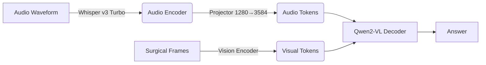
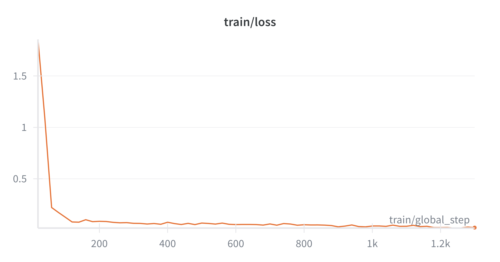
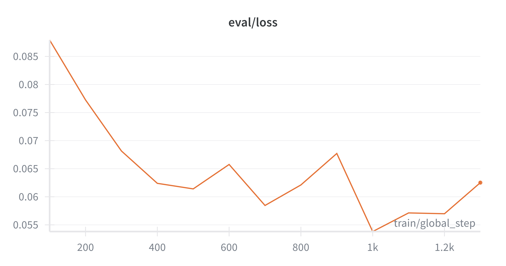

# 🩺 SurgViVQA-Audio: Audio-Adapted Qwen2-VL for Surgical Video QA
> **Goal:** Engineering a multimodal agent to “hear” live OR audio (no ASR) and “see” surgical video for surgical QA.
> ⚠️ **Research prototype only — not for clinical use.**

**Quick Links:** [🤗 Model Weights](https://huggingface.co/kulsoom-abdullah/surgvivqa-qwen7b-audio) | [📊 Data Distribution](docs/data_distribution.md) | [🎬 Streamlit Demo](#streamlit-demo) | [📈 Results](#results)

> **Data note:** This repo does **not** redistribute SurgViVQA frames or the generated TTS audio. It includes scripts to reproduce preprocessing from the public benchmark.

---

<a id="results"></a>
## 📈 Results

The model answers questions about surgical video from **spoken audio only** — no question
text reaches the model at any point. Fine-tuning raised audio-only accuracy from **10.7% to
57.1%** on 1,000 held-out samples from a patient absent from training.

> The 10.7% figure is the same Qwen2-VL + Whisper stack before the audio adapter was
> trained (`results/baseline/cell2_base_audio.jsonl`).

That headline number is close to meaningless on its own, and the rest of this section is
about why.

### The benchmark has a floor, and it beats every model tested

Seven of 20 question types have a single gold answer across all 50 of their test rows
(`blue_dye_presence`, `endoscope_visibility`, `lesion_histology_extended`,
`lesion_size_range`, `lighting_mode`, `tool_catheter_check`, `tool_identification`). For
those **350 rows — 35% of the test set — a constant string scores 100%** and no model can
be distinguished from a lookup table.

**A control with no perception at all.** Consider something that is not a model: it hears
nothing, sees nothing, and knows only *which of the 20 question types was asked*. For each
type it emits a single canned answer — the most common answer for that type in the
training data. It can be right for no reason other than how the answers are distributed.

| no-perception control | full 1,000 | discriminative 650 |
|---|---|---|
| **most common training answer per type** (a deployable system could do this) | **57.3%** | **42.0%** |
| most common *test* answer per type (needs the test labels — upper bound only) | 64.8% | 45.8% |

**57.3% edges out every system measured here, including this one at 57.1% — using no
video and no audio.** That does not mean this model sees nothing. It means aggregate
accuracy on this benchmark cannot tell the difference, because the answer distribution
alone gets you there.

All comparisons below therefore use the **650 rows from the 13 question types that have
more than one answer in the test set**. The test-answer version above is shown only as a
ceiling; no deployable system has access to test-set answer distributions, so scoring
against it holds every model to a bar built from answers it never saw.

**Two different references, and they answer different questions.** A *majority baseline*
answers "does aggregate accuracy on this benchmark measure priors rather than perception?"
*Per-type chance* (`1/|A_t|`, one over the number of answers a question type actually has)
answers "can any model do this question type at all?" The two coincide except where the
training majority collapses — see the family table below.

### Capability is a function of question family, not of model

Five systems on identical rows, frames, prompt, and grading rule. Stock models receive the
question as text; this model receives it as audio.

Margins here are reported against **per-type chance**, which coincides with the test-answer
floor for families A, C and D. Family B is the one divergence — its four classes are not
exactly even, so its test floor is 26.0 against a chance of 25.0, and the table uses 26.0.
The training-answer floor is used for the aggregate argument above, because that argument
is about what a deployable prior-only system achieves; it is **not** used per-type, because
on two question types the training majority answer never occurs in the held-out video and
the floor collapses to zero for reasons unrelated to difficulty.

| question family | n | floor | **this model** (audio) | Qwen2-VL-7B | Qwen2.5-VL-7B | Qwen3-VL-8B | Qwen3-VL-32B |
|---|---|---|---|---|---|---|---|
| **A. Static scene state** | 300 | 50.0 | **+12.3** | +5.7 | +0.3 | +5.0 | **+17.3** |
| **B. Screen-space position** | 50 | 26.0 | +0.0 | +8.0 | −4.0 | −4.0 | **+22.0** |
| **C. Temporal / motion** | 250 | 44.0 | +0.4 | +2.4 | +2.4 | +4.8 | +4.8 |
| **D. Anatomical / diagnostic** | 200 | 87.5 | −57.0 | −79.0 | −87.5 | −60.0 | −58.5 |

**Why family D's floor is 87.5 and not the training-answer 50.0.** 87.5 *is* per-type
chance for this family: three of its four types are degenerate — one test answer, so chance
is 100% — and `lesion_site` is binary, so `(0.5×50 + 50 + 50 + 50) / 200 = 87.5`. The
train-derived 50.0 is an artifact: on `lesion_site` and `tool_identification` the training
majority answer never appears in this patient's test answers at all, so a control trained on
the training set scores **0/50** on both and the family floor collapses for reasons that
have nothing to do with how hard the questions are. The train-derived reading (floor 50.0,
this model −19.5) is recorded in [`docs/RESULTS.md`](docs/RESULTS.md) for audit.

Three findings, each supported by five independent systems spanning 7B→33B and two model
generations:

**Static scene state is where vision works.** Is NBI lighting on, is mucosa visible, is the
view occluded, is the scope outside the patient. Every model clears the floor. This model
clears it by more than three of the four stock models.

**Temporal reasoning is absent for everyone.** +0.4 to +4.8 across a 4.7× parameter range.
`lesion_motion_direction` sits at 12–24% against a 20% floor for *every* system. Eight
frames sampled at a fixed offset do not contain the labeled motion, and no amount of model
recovers signal that was never captured.

**Screen-space position is recoverable, and this model does not recover it.** Qwen3-VL-32B
scores +22 over floor; this model sits at exactly the floor, emitting one constant string
for all 50 rows. This is a capability gap, not a frame-sampling limit — and it is at the
same 384px resolution.

Full 20-type table, both grading rules, and the vocabulary-normalization audit are in
[`docs/RESULTS.md`](docs/RESULTS.md).

### The audio pathway works, and that is measured separately

Before fine-tuning, given spoken audio and no question text, the base model
reproduced the question it had heard on **488 of 1,000 rows** — and identified
**the correct spoken question** out of the 20 in the corpus on 472 of those,
**96.7% against a 5% chance rate** (permutation null across 200 shuffles: 4.9%).
At a stricter matching threshold, 414 rows are identified at 100%.

So audio comprehension is present before any task fine-tuning. What fine-tuning supplied is
answer format and partial visual grounding, not the ability to hear the question.

### Direct audio input is not faster than transcription

Measured on matched hardware, weights, frames, and decoding budget (n=100, medians):

| | ASR pipeline | direct audio |
|---|---|---|
| transcription | 73.3 ms | — |
| prefill | 870.1 ms | 1270.1 ms |
| decode per generated token | 62.0 ms | 62.0 ms |
| **end to end** | **1677.5 ms** | **1895.6 ms** |

**0.88× — direct audio is 13% slower.** The entire difference is prefill: the audio path
carries 2,795 input tokens against 1,294, because the encoder emits a fixed 1,500 tokens
for a 30-second window regardless of the actual utterance, which here runs 2.8–4.1 seconds.
Skipping transcription saves 73 ms; paying for the fixed-length audio context costs 400 ms.

The architectural case for direct audio therefore rests on eliminating
transcription-error propagation and on joint representation of prosody and background
sound — not on latency. Longer utterances would shift this, since transcription cost scales
with speech length while the audio prefix does not; the crossover is estimated near 20–25
seconds of speech and has not been measured.

### What this project does not show

- No advantage over an off-the-shelf 33B vision-language model on the discriminative subset
  (49.5% vs 54.3%)
- No temporal reasoning, by any model tested
- Losses to stock models on `mucosa_visibility` (48% vs 64–80%) and `occlusion_check`
  (50% vs 86–88%)
- Output diversity of ~1–2 distinct strings per question type, against 33 for Qwen3-VL-32B —
  most of this model's aggregate lead comes from having learned the correct constant for the
  single-class types, not from visual discrimination

### Zero-shot comparison: MiniCPM-o 4.5

An off-the-shelf omni model built the same way as this project — a Whisper encoder
projected into an LLM (SigLIP2 + Whisper-medium + Qwen3-8B, 9B total) — evaluated
zero-shot on the same 1,000 rows: same audio clips, same 8 frames, same instruction
string, same grading rule.

**47.1% full / 43.1% discriminative-650 — reported as a non-capability measurement.**

A pre-specified audit found **33% of its failures were answer-set mismatch rather than
wrong answers**. `fluid_occlusion_level` admits only `absent` or `complete`;
`lesion_site` only `sigma` or `rectum`. The model answers "moderate" and "colon" —
defensible readings of the scene, in vocabulary this corpus does not contain and never
shows it. The pre-registered rule voids the capability claim at a 20% threshold, so no
comparison to this system's 49.5% is licensed.

Per-type results split cleanly. Where the answer space is obvious from the question
(yes/no, advancing/withdrawing) the baseline sits at chance — 0.44 to 0.52 against a 0.50
floor. Where the answer space is restricted and unguessable, it collapses to zero: four
question types flagged. Answer-set mismatch explains the collapses; it does not explain
the middle band.

Criteria, outcome bands, and abandonment conditions were fixed in
[PRE_REGISTRATION.md](PRE_REGISTRATION.md), committed and tagged
`prereg-omni-baseline` before any baseline model was downloaded. Phi-4-multimodal was
screened and attempted but never probed — it ran out of memory at the first generation,
requesting 29.5 GiB for a single attention matrix on a 48 GB card with 8 frames plus audio
at eager attention. Recorded as a capacity result, not a capability one.

---

## 🏗️ Architecture

The architecture bypasses the standard ASR (Speech-to-Text) pipeline to avoid error propagation, allowing the model to process raw audio embeddings directly alongside visual tokens.


```mermaid
graph LR
    A[Audio Waveform] -->|Whisper v3 Turbo| B(Audio Encoder)
    B -->|Projector 1280→3584| C(Audio Tokens)
    D[Surgical Frames] -->|Vision Encoder| E(Visual Tokens)
    C --> F[Qwen2-VL Decoder]
    E --> F
    F --> G[Answer]
```

### Audio Adaptation Strategy
* **Base Model:** Qwen2-VL-7B-Instruct
* **Audio Encoder:** Whisper Large v3 Turbo (Frozen)
* **Projector:** Linear Layer (1280 → 3584) trained to map audio features to the LLM's embedding space
* **Innovation:** Direct injection of 1,500 audio tokens into the multimodal sequence, allowing the model to attend to "sound" and "sight" jointly

### QLoRA Training Config

* **Hardware:** 2x NVIDIA RTX 4090 (24GB VRAM each)
* **Precision:** 4-bit Base Model + BF16 LoRA Adapters
* **LoRA Config:** Rank 64, Alpha 16, targeting all attention/MLP projections
* **Target Modules:** All linear projections (`q_proj`, `k_proj`, `v_proj`, `o_proj`, MLP layers)
* **Label Masking:** Strictly mask all vision/audio tokens (`-100`), calculating loss **only** on the assistant's text response
* **Early Stopping:** Patience=3, monitoring eval_loss (training stopped at epoch 4.53, best was 3.48)
* **Training Time:** ~6 hours for 2,300 samples on 2x RTX 4090

### 📈 Training Dynamics (Weights & Biases)

I tracked training stability using Weights & Biases to ensure proper convergence without overfitting.

| **Training Loss** | **Validation Loss (Eval)** |
| :---: | :---: |
|  |  |
| *Rapid convergence in first 200 steps* | *Optimal generalization at Step 1000 (Loss ~0.054)* |

**Analysis:**
* **Convergence:** Training loss dropped sharply, confirming the audio features were successfully mapped to the LLM embedding space.
* **Early Stopping:** Validation loss bottomed out at **Step 1000** (Epoch 3.48) and began to rise shortly after (Step 1300), triggering early stopping mechanism to prevent overfitting.
* **Total Training Time:** 350 minutes (~5.8 hours) on 2x RTX 4090.

### Memory Optimization Decisions

* **Image Resize:** Downsampled to 384x384. While this impacts small tool detection, it was necessary to fit batch size 1 on consumer VRAM
* **Attention:** Used `sdpa` (Scaled Dot Product Attention) for quantization compatibility
* **Gradient Checkpointing:** Non-reentrant mode for DDP + QLoRA compatibility

---

## 📊 Data Distribution

I used a portion of the [**SurgViVQA**](https://github.com/madratak/SurgViVQA/) dataset [1], generating audio from the text questions using [edge-tts](https://github.com/rany2/edge-tts) to simulate a spoken-query environment.

### Dataset Splits

| Split | Samples | Video IDs (Procedures) | Purpose |
|-------|---------|------------------------|---------|
| **Train** | 2,302 | 002-001, 002-002, 002-003 | Model Training |
| **Eval** | 398 | 002-001, 002-002, 002-003 | In-Training Validation |
| **Test** | 1,000 | 002-004 (held-out) | Generalization Testing |
| **Total** | **3,700** | 4 colonoscopy procedures | 20 question types |

**Terminology:** Each **sample** = 1 question + 8 consecutive frames + 1 answer. **Video IDs** refer to different colonoscopy procedures.

### High-Level Statistics

- **Question Types:** 20 distinct categories across 4 reasoning domains
- **Answer Format Distribution:**
  - **Yes/No questions:** 13 types (65% of question types)
    - Examples: occlusion_check, scope_motion, tool_catheter_check
  - **Limited-Choice questions:** 7 types (35% of question types)
    - 2-5 options per question
    - Examples: lesion_motion_direction (5 directions), lesion_site (4 locations), scope_motion_type (2 types)
- **Answer Distribution (training set):**
  - Yes: 25.7% | No: 35.4% | Limited-choice: 38.8%
- **Held-Out Test Set Characteristics:**
  - Mixed balance: Motion and occlusion questions are balanced (50/50), while tool/dye presence questions in this specific video slice are single-class (100% 'No'), reflecting the specific procedure's nature.
  - Limited-choice questions evenly distributed (e.g., lesion_motion_direction: 20% per direction)
  - Some categories have zero variety (lesion_size_range: 100% <5mm, tool_identification: 100% forceps)

📄 **See detailed breakdown:** [docs/data_distribution.md](docs/data_distribution.md)

## 📏 Evaluation Methodology

### Metric: Keyword-Based Exact Match Accuracy

Since our questions are classification tasks (binary Yes/No or multi-class with 2-5 options), we evaluate using **answer keyword matching** rather than text generation metrics like BLEU or ROUGE.

**Implementation:**
```python
is_correct = sample['short_answer'].lower() in predicted.lower()
```

Results are also scored under a stricter word-boundary rule with three carve-outs
(`complete`/`completely`, `down`/`downward`, `up`/`upward`). **The two rules agree on
all 1,000 rows for both the fine-tuned model and the zero-shot baseline** — zero
disagreements — so substring matching is not inflating any number reported here.

**Why this approach?**
- ✅ **Verifies factual correctness** regardless of phrasing
- ✅ **Allows natural language responses** from the LLM
- ✅ **Standard for factoid QA** (similar to SQuAD, TriviaQA evaluation)

**Example:**

| Ground Truth | Model Response | Evaluated As |
|--------------|----------------|--------------|
| "left" | "left" | ✅ Correct |
| "left" | "The lesion is moving to the left" | ✅ Correct (contains keyword) |
| "left" | "right" | ❌ Wrong |
| "Yes" | "Yes, there is occlusion present" | ✅ Correct |
| "NBI" | "The lighting mode is NBI" | ✅ Correct |

This is **not** text generation quality evaluation—we only care that the model gets the right factual answer, not how eloquently it phrases it.

---

## 🛠️ Engineering Journey

- **Stratified splitting** — `tool_identification` is only 3.7% of the data, so random
  splitting risked dropping whole categories from validation. Splits are stratified by
  question type ([`scripts/create_multivideo_split.py`](scripts/create_multivideo_split.py)).
- **Held-out video** — evaluation runs on video `002-004`, a patient absent from training,
  so the reported numbers cannot come from memorized procedure-specific patterns.
- **Deployment** — an interactive Streamlit app ([`src/app.py`](src/app.py)) with flipbook
  frame playback, question-type filtering, and live audio recording.

Earlier steps (a 10-sample overfit run to confirm gradient flow through the audio path)
are development detail, not results.

## 🤗 Model Weights (Hugging Face)

Weights + model card: https://huggingface.co/kulsoom-abdullah/surgvivqa-qwen7b-audio

This repo uses the HF weights via the existing training/eval scripts. If you're just evaluating:
- download/point to the checkpoint
- run `src/evaluate_checkpoint.py` as shown below

### 1. Setup Environment

```bash
# Clone repository
git clone https://github.com/kulsoom-abdullah/SurgViVQA-Audio
cd SurgViVQA-Audio

# Create virtual environment
python3 -m venv venv
source venv/bin/activate

# Install dependencies
pip install -r requirements.txt
```

<a id="streamlit-demo"></a>
### 🎬 2. Streamlit Demo

Running on 1x RTX 4090.

To launch the interactive surgical VQA assistant:

```bash
streamlit run src/app.py --server.port 8501 --server.address 0.0.0.0
```

**Features:**
- 🎤 Record audio questions via microphone
- 🎞️ View 8-frame surgical sequences in grid layout
- ▶️ Flipbook animation (2 FPS) to visualize motion
- 🎯 Live model inference with ground truth comparison
- 📊 Question type filtering (20 categories)
- 📈 Performance stats display in sidebar

### 🔍 Data Viewer

A lightweight local browser for inspecting dataset samples and overlaying model predictions — no GPU, no extra dependencies. Setup and usage: [`docs/data_viewer.md`](docs/data_viewer.md).

> **⚠️ Under revision (July 2026):** the viewer can display a sample alongside another sample's question and answer. Treat its output as unverified.

---

### 3. Reproduction (Training)

To reproduce the multi-video training run:


```bash
# Generate stratified train/eval/test splits
python3 scripts/create_multivideo_split.py

# Generate TTS audio (if not using pre-generated)
bash scripts/generate_audio_multivideo.sh

# Run overnight training (8 epochs, early stopping)
bash scripts/train_multivideo_overnight.sh
```

**Expected:** Training will stop around epoch 5-6 due to early stopping (patience=3).

### 4. Evaluation

Evaluate a trained checkpoint on the held-out test set:

```bash
python3 src/evaluate_checkpoint.py \
    --checkpoint_path ./checkpoints/surgical_vqa_multivideo \
    --eval_data_path data/test_multivideo.jsonl \
    --frames_dir data/frames \
    --audio_dir data/audio \
    --output_file results/final_test_002004.jsonl
```

---

## 📂 Project Structure

Generated from `git ls-files` — everything below is tracked in the repo. Bulk directories
are summarised with a file count rather than enumerated.

```text
SurgViVQA-Audio/
├── PRE_REGISTRATION.md              # Omni-baseline study, tagged before any measurement
├── omni_baseline_screening.md       # Screening plan and cost model for that study
├── requirements.txt
├── voices.txt                       # 41 edge-tts voices, split speaker-disjoint
├── src/
│   ├── train_vqa.py                 # Main training loop (QLoRA + audio adaptation)
│   ├── app.py                       # Streamlit demo (interactive inference)
│   ├── evaluate_checkpoint.py       # Standalone evaluation script — the shared harness
│   ├── evaluate_zeroshot.py         # Vision+text zero-shot (no audio path)
│   ├── evaluate_qwen3.py            # Cross-generation comparison runs
│   ├── analyze_errors.py            # Per-type failure inspection
│   ├── audio/
│   │   ├── generate_audio.py        # K2-keyed TTS generation
│   │   ├── voice_split.py           # Speaker-disjoint voice roster (seed 20260725)
│   │   └── verify_audio_coverage.py
│   ├── frames/
│   │   └── verify_frame_coverage.py
│   ├── bench/
│   │   ├── omni_adapters.py         # Shared adapters + leak gate — probe and run use ONE path
│   │   ├── omni_baseline.py         # Stage 5 run harness (off-the-shelf omni arm)
│   │   ├── verify_combined_path.py  # Gate 3 probe: determinism, audio, image pathways
│   │   ├── freeze_configs.py        # Stage 2 assertions; source of the strict scoring rule
│   │   ├── capacity_control.py      # Four stock VLMs on identical rows
│   │   └── latency_bench.py         # Direct audio vs ASR pipeline, matched hardware
│   └── analysis/
│       ├── question_identification.py
│       └── stage6_baseline_audit.py # Format-failure audit, stratification, §6 lookup
├── configs/
│   └── parity.yaml                  # Frozen Parity-B instruction + sha256 pin
├── data/
│   ├── train_multivideo.jsonl       # Multi-video train split
│   ├── eval_multivideo.jsonl        # Multi-video eval split
│   ├── test_multivideo.jsonl        # Held-out test split (video 002-004)
│   ├── probe_pairs.json             # Gate 3b cross-type audio pairs
│   ├── in_template.jsonl            # Prompt template (input)
│   ├── out_template.jsonl           # Prompt template (output)
│   └── audio/_canonical/            # 820 canonical TTS clips (per-row files are hardlinks)
├── results/
│   ├── baseline/                    # Cell 1/2 base arms + the MiniCPM-o zero-shot run
│   ├── cell3/                       # Fine-tuned audio-only predictions (57.1%) + train.log
│   ├── capacity/                    # Four stock VLMs + vocabulary re-grade
│   ├── bench/                       # Latency benchmark
│   └── *.jsonl                      # Cross-generation comparison runs cited in Results
├── artifacts/
│   ├── probe/                       # Gate 3 probe output, post-refactor
│   └── probe_pre_refactor/          # Same gates pre-refactor, kept for the diff
├── analysis/
│   ├── omni_baseline/               # Stage 6 audit output
│   └── audio_ablation/              # Earlier ablation runbook and claims audit
├── docs/
│   ├── RESULTS.md                   # Full 20-type tables, both grading rules, audits
│   ├── data_viewer.md               # Data viewer setup and usage
│   ├── data_distribution.md         # Detailed stats
│   ├── data_stats.json              # For the Streamlit app
│   ├── train_loss.png               # W&B plot
│   ├── eval_loss.png                # W&B plot
│   └── run_evidence/                # W&B run config, metadata, system metrics
├── baselines/
│   ├── baseline1_text_image.py      # Text-only questions + image (standard VQA setup)
│   ├── baseline2_audio_image.py     # Audio → Whisper encoder embeddings (no decoding) → Qwen2-VL
│   └── baseline3_asr_pipeline.py    # Two-stage: audio → Whisper ASR text → Qwen2-VL
├── scripts/                         # 32 files: splitting, TTS, viewer generation, pod setup
│   ├── create_multivideo_split.py   # Stratified data splitting
│   ├── generate_viewer_html.py      # Builds the local data viewer
│   ├── download_sample_frames.py    # Figshare frame retrieval + coverage verify
│   └── train_multivideo_overnight.sh
├── viewer/                          # Generated HTML viewers (see docs/data_viewer.md)
├── test_set/                        # Small fixtures for CI/validation
└── transformers_fork/               # Vendored fork (4,797 files) for the audio-adapter path
```

**Not in the repo** (generated locally or hosted elsewhere): `data/frames/` and the
per-row `data/audio/{train,eval,test}/` clips, `checkpoints/` (LoRA adapters — published
to [Hugging Face](https://huggingface.co/kulsoom-abdullah/surgvivqa-qwen7b-audio)
instead), and W&B run directories.

---

## 🔮 Future Work

Ordered by expected value, with rationale and current evidence, in
[`docs/RESULTS.md` §10](docs/RESULTS.md#10-future-work): targeted frame
resampling, native video input, variable-length audio encoding, acoustic
robustness, and denser frame sampling.

The off-the-shelf omni-model comparison is **done** — see
[Zero-shot comparison: MiniCPM-o 4.5](#zero-shot-comparison-minicpm-o-45) above.

---

## 🎓 Acknowledgments & Citations

### Dataset
I utilized the **SurgViVQA** dataset [1], converting the text questions to audio using edge-tts to simulate a spoken-query environment.

**[1] SurgViVQA (2025)**
*Drago, M. O., et al.* "SurgViVQA: Temporally-Grounded Video Question Answering for Surgical Scene Understanding." arXiv preprint arXiv:2511.03325.

<details>
<summary>Click for BibTeX</summary>

```bibtex
@misc{drago2025surgvivqa,
      title={SurgViVQA: Temporally-Grounded Video Question Answering for Surgical Scene Understanding},
      author={Mauro Orazio Drago et al.},
      year={2025},
      eprint={2511.03325},
      archivePrefix={arXiv},
      primaryClass={cs.CV}
}

```

</details>

### Models

* **Vision-Language:** [Qwen2-VL-7B-Instruct](https://huggingface.co/Qwen/Qwen2-VL-7B-Instruct)
* **Audio Encoder:** [Whisper Large v3 Turbo](https://huggingface.co/openai/whisper-large-v3-turbo)


---
## 🖊️ Citing This Work

A technical paper describing this project is currently in preparation. In the meantime, if you use this code or model, please cite the repository:

```bibtex
@software{abdullah2026surgvivqa,
  author = {Abdullah, Kulsoom},
  title = {SurgViVQA-Audio: Audio-Adapted Qwen2-VL for Surgical Video QA},
  year = {2026},
  publisher = {GitHub},
  journal = {GitHub repository},
  url = {https://github.com/kulsoom-abdullah/SurgViVQA-Audio}
}
```
---

## 📜 License

This project is licensed under the **Apache 2.0 License**.

You are free to use, modify, and distribute this software, provided that proper credit is given (see Citation above).

- See [LICENSE](LICENSE) for the full text.
---

## 📧 Contact

**[Kulsoom Abdullah](https://www.linkedin.com/in/kulsoomabdullah/)**

---

*Built with: PyTorch, [Transformers (custom fork)](https://github.com/kulsoom-abdullah/Qwen2-VL-Audio-Adapter/tree/main/transformers_fork), PEFT, Streamlit, Librosa, Edge-TTS*
